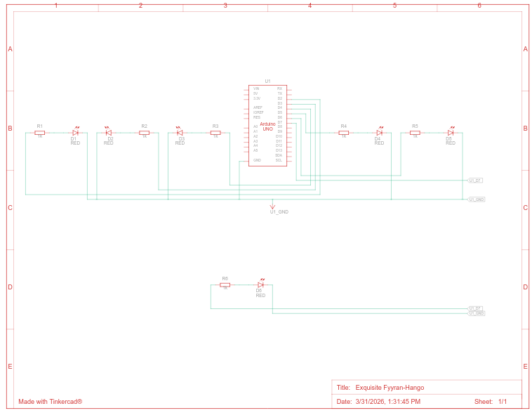

# Praktikum Pemrograman Sistem Tertanam

## Pertanyaan praktikum bagian perulangan

1. Gambarkan rangkaian schematic 5 LED running yang digunakan pada percobaan!
2. Jelaskan bagaimana program membuat efek LED berjalan dari kiri ke kanan!
3. Jelaskan bagaimana program membuat LED kembali dari kanan ke kiri!
4. Buatkan program agar LED menyala tiga LED kanan dan tiga LED kiri secara bergantian

### Jawaban

1. Rankaian schematic 5 LED



2. Kenapa program bisa membuat efek LED berjalan dari kiri ke kanan

Program berjalan dari kiri ke kanan atau dari pin terendah ke tinggi

```c
  for (int ledPin = 2; ledPin < 8; ledPin++) {
   // hidupkan LED pin nya:
   digitalWrite(ledPin, HIGH);
   delay(timer);
   // matikan pin LED nya:
   digitalWrite(ledPin, LOW);
  }

```

dari kode perulangan tersebut, menghidupkan lampu dari led pin 2 sampai pin 7, jika pin 2 posisi ada dikiri maka lampu akan menyala dari kiri ke kanan maupun sebaliknya.

3. Kenapa program bisa membuat efek LED berjalan dari kanan ke kiri

Program berjalan dari kanan ke kiri atau dari pin tertinggi ke terendah.

```c

   // looping dari pin yang tinggi ke yang rendah
   for (int ledPin = 7; ledPin >= 2; ledPin--) {
    // menghidupkan pin:
    digitalWrite(ledPin, HIGH);
    delay(timer);
    // mematikan pin:
    digitalWrite(ledPin, LOW);
  }
}
```

dari kode tersebut, lampu dinyalakan dari pin led nomor 7 sampai dengan nomor 2, yang dimana jika posisi pin nomor 7 diletakan paling kanan, maka lampu led bergerak dari arah kanan ke kiri.

4. Membuat program led 6 lampu menyala 3 kiri dan 3 kanan secara bergantian.

```c
// Setup pin dari nomor 2 (kiri) sampai pin 7 (kanan)
void setup(){
  for(int i = 2; i <= 7; i++){
    pinMode(i, OUTPUT);
  }
}

void loop(){
  // program menyalakan lampu pada 3 lampu kiri, pin 2,3, dan 4, serta mematikan lampu dengan pin 5,6, dan 7
   digitalWrite(2,HIGH);
   digitalWrite(3,HIGH);
   digitalWrite(4,HIGH);
   digitalWrite(5,LOW);
   digitalWrite(6,LOW);
   digitalWrite(7,LOW);
    delay(1000);

  // program menayalakan lampu pada 3 lampu kanan, pin 5,6, dan 7, serta mematikan lampu dengan pin 2,3, dan 4
    digitalWrite(2,LOW);
    digitalWrite(3,LOW);
    digitalWrite(4,LOW);
    digitalWrite(5,HIGH);
    digitalWrite(6,HIGH);
    digitalWrite(7,HIGH);
    delay(1000);
}
```
