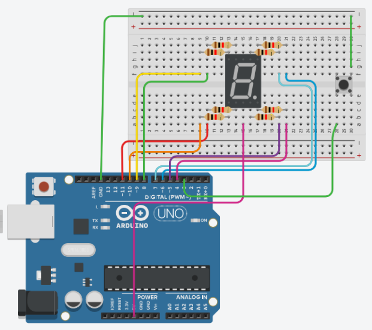
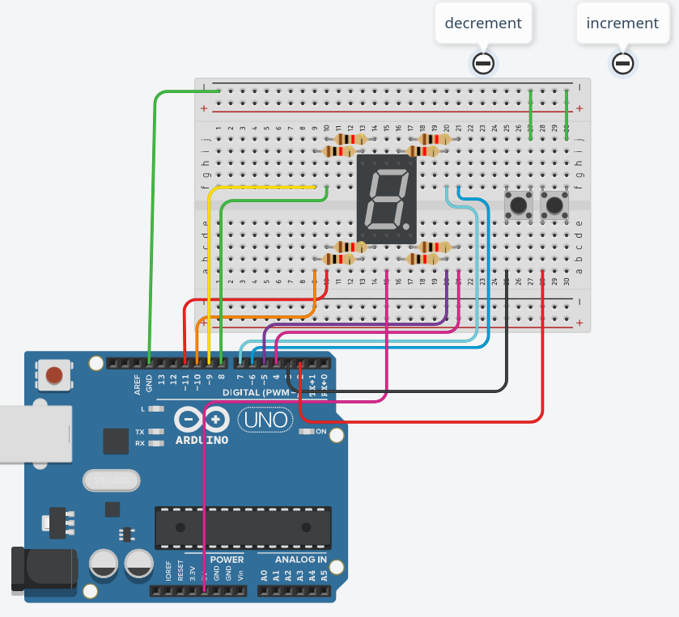

# Pertanyaan Kontrol Counter Dengan Push Button

## Pertanyaan
1. Gambarkan rangkaian schematic yang digunakan pada percobaan!
2. Mengapa pada push button digunakan mode INPUT_PULLUP pada Arduino Uno? Apa keuntungannya dibandingkan rangkaian biasa?
3. Jika salah satu LED segmen tidak menyala, apa saja kemungkinan penyebabnya dari sisi hardware maupun software?
4. Modifikasi rangkaian dan program dengan dua push button yang berfungsi sebagai penambahan (increment) dan pengurangan (decrement) pada sistem counter dan berikan penjelasan disetiap baris kode nya dalam bentuk README.md!


## jawaban

1. Gambarkan rangkaian schematic yang digunakan pada percobaan!



2. Mengapa pada push button digunakan mode INPUT_PULLUP pada Arduino Uno? Apa keuntungannya dibandingkan rangkaian biasa?

Mode INPUT_PULLUP pada Arduino Uno digunakan untuk mengaktifkan resistor internal yang berfungsi menjaga stabilitas tegangan pin input agar tidak berada dalam kondisi mengambang (floating). Penggunaan mode ini memastikan pin selalu berlogika HIGH secara konstan melalui koneksi internal ke tegangan 5V, sehingga pembacaan nilai digital menjadi akurat dan terhindar dari gangguan elektromagnetik lingkungan. Keuntungan utamanya dibandingkan rangkaian biasa adalah efisiensi perangkat keras karena tidak memerlukan resistor eksternal tambahan, yang secara langsung menyederhanakan skema pengabelan pada papan rangkaian.

3. Jika salah satu LED segmen tidak menyala, apa saja kemungkinan penyebabnya dari sisi hardware maupun software?

Penyebab LED segmen tidak menyala dari sisi perangkat keras meliputi adanya kerusakan fisik pada dioda LED di dalam Seven Segment, koneksi kabel jumper yang longgar, atau pemasangan resistor yang tidak tepat pada breadboard. Selain itu, kesalahan penempatan pin Common Anode atau Common Cathode pada jalur tegangan atau ground yang salah dapat mengakibatkan aliran arus terputus ke segmen tertentu. Dari sisi perangkat lunak, kegagalan ini sering disebabkan oleh kesalahan pendefinisian nomor pin pada kode program atau kesalahan logika array biner yang menentukan status High/Low untuk setiap segmen. Masalah tersebut juga dapat muncul jika terdapat konflik penggunaan pin dengan fungsi lain atau kesalahan penulisan instruksi pinMode() yang lupa mengonfigurasi pin terkait sebagai output dalam fungsi setup().

4. Modifikasi rangkaian dan program dengan dua push button yang berfungsi sebagai penambahan (increment) dan pengurangan (decrement) pada sistem counter dan berikan penjelasan disetiap baris kode nya dalam bentuk README.md!

### skematik



### kode

```cpp
const int segmentPins[8] = {7,6,5,11,10,8,9,4};

const int btnUp = 2;
const int btnDown = 3;

byte digitPattern[16][8] = {
  {1,1,1,1,1,1,0,0}, // 0
  {0,1,1,0,0,0,0,0}, // 1
  {1,1,0,1,1,0,1,0}, // 2
  {1,1,1,1,0,0,1,0}, // 3
  {0,1,1,0,0,1,1,0}, // 4
  {1,0,1,1,0,1,1,0}, // 5
  {1,0,1,1,1,1,1,0}, // 6
  {1,1,1,0,0,0,0,0}, // 7
  {1,1,1,1,1,1,1,0}, // 8
  {1,1,1,1,0,1,1,0}, // 9
  {1,1,1,0,1,1,1,0}, // A
  {0,0,1,1,1,1,1,0}, // b
  {1,0,0,1,1,1,0,0}, // C
  {0,1,1,1,1,0,1,0}, // d
  {1,0,0,1,1,1,1,0}, // E
  {1,0,0,0,1,1,1,0}  // F
};

int currentDigit = 0;

bool lastUpState = HIGH;
bool lastDownState = HIGH;

void displayDigit(int num){
    for (int i = 0; i < 8; i++){
        digitalWrite(segmentPins[i], !digitPattern[num][i]);
    }
}

void setup(){
    for(int i = 0; i < 8; i++){
        pinMode(segmentPins[i], OUTPUT);
    }

    pinMode(btnUp, INPUT_PULLUP);
    pinMode(btnDown, INPUT_PULLUP);

    displayDigit(currentDigit);
}

void loop(){
    bool upState = digitalRead(btnUp);
    bool downState = digitalRead(btnDown);

    // tombol UP
    if (lastUpState == HIGH && upState == LOW){
        currentDigit++;
        if(currentDigit > 15) currentDigit = 0;

        displayDigit(currentDigit);
        delay(200); // debounce
    }

    // tombol DOWN
    if (lastDownState == HIGH && downState == LOW){
        currentDigit--;
        if(currentDigit < 0) currentDigit = 15;

        displayDigit(currentDigit);
        delay(200); // debounce
    }

    lastUpState = upState;
    lastDownState = downState;
}
```