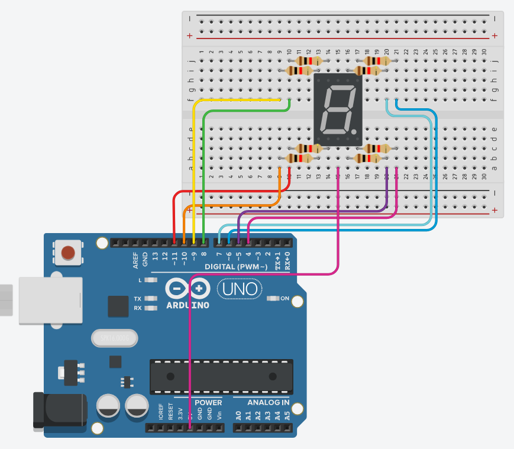

# Pertanyaan praktikum seven segment

## Pertanyaan
1. Gambarkan rangkaian schematic yang digunakan pada percobaan!
2. Apa yang terjadi jika nilai num lebih dari 15?
3. Apakah program ini menggunakan common cathode atau common anode? Jelaskan
alasanya!
4. Modifikasi program agar tampilan berjalan dari F ke 0 dan berikan penjelasan disetiap
baris kode nya dalam bentuk README.md!

## Jawaban

1. Gambarkan rangkaian schematic yang digunakan pada percobaan!



2. Apa yang terjadi jika nilai num lebih dari 15?

```cpp
void displayDigit(int num){
    for (int i = 0 ; i < 8; i++){
        digitalWrite(segmentPins[i],!digitPattern[num][i]);
    }
}
```

jika nilai num pada fungsi display digit lebih dari 15 maka kode yang ada pada blok for (perulangan) tidak akan tereksekusi.
namun jika kode blok for tidak ada, atau lansgun memanggil digital write maka kode program akan error dikarenakan array dari digitPattern itu hanya sampai 15 

3. Apakah program ini menggunakan common cathode atau common anode? Jelaskan alasanya!

Dalam praktikum kali ini menggunakan seven segment common anode.


pada praktikum menggunakan seven segment anode, karena pin menggunakan vcc (5v). Kalau salah tipe, rangkaian tidak akan bekerja benar.

4. Modifikasi program agar tampilan berjalan dari F ke 0 dan berikan penjelasan disetiap
baris kode nya dalam bentuk README.md!

```cpp
// inisialisasi pin pada arduino
const int segmentPins[8] = {7,6,5,11,10,8,9,4};

// inisialisasi digitPattern 0-9 dan A-F
byte digitPattern[16][8] = {
  {1,1,1,1,1,1,0,0}, // 0
  {0,1,1,0,0,0,0,0}, // 1
  {1,1,0,1,1,0,1,0}, // 2
  {1,1,1,1,0,0,1,0}, // 3
  {0,1,1,0,0,1,1,0}, // 4
  {1,0,1,1,0,1,1,0}, // 5
  {1,0,1,1,1,1,1,0}, // 6
  {1,1,1,0,0,0,0,0}, // 7
  {1,1,1,1,1,1,1,0}, // 8
  {1,1,1,1,0,1,1,0}, // 9
  {1,1,1,0,1,1,1,0}, // A
  {0,0,1,1,1,1,1,0}, // b
  {1,0,0,1,1,1,0,0}, // C
  {0,1,1,1,1,0,1,0}, // d
  {1,0,0,1,1,1,1,0}, // E
  {1,0,0,0,1,1,1,0}  // F
};

// Fungsi displayDigit untuk menyalakan sevensegment sesuai variabel `num`
void displayDigit(int num){
    for (int i = 0 ; i < 8; i++){
        digitalWrite(segmentPins[i],!digitPattern[num][i]);
    }
}

// void setup sebagai inisialisasi pin ke mode OUTPUT
void setup(){
    for(int i = 0;i < 8;i++){
        pinMode(segmentPins[i],OUTPUT);
    }
}

// void loop untuk menjalankan kode berulang dan menyalakan sevensegment dari digitPattern 15 ke 0
// dengan delay 1000ms atau 1detik
void loop(){
    for(int i = 15;i>=0;i--){
        displayDigit(i);
        delay(1000);
    }
}
```
