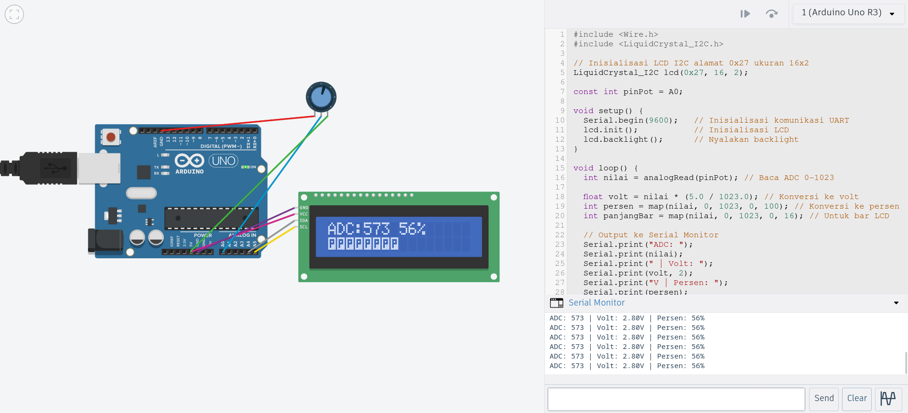

# Pertanyaan praktikum Inter Integrated Circuit (i2c)

## Pertanyaan

1. Jelaskan bagaimana cara kerja komunikasi I2C antara Arduino dan LCD pada rangkaian tersebut!
2. Apakah pin potensiometer harus seperti itu? Jelaskan yang terjadi apabila pin kiri dan pin kanan tertukar!
3. Modifikasi program dengan menggabungkan antara UART dan I2C (keduanya sebagai output) sehingga:
- Data tidak hanya ditampilkan di LCD tetapi juga di Serial Monitor
- Adapun data yang ditampilkan pada Serial Monitor sesuai dengan table berikut:

| ADC: 0 | Volt: 0.00V | Persen: 0% |
| :--- | :--- | :--- |

Tampilan jika potensiometer dalam kondisi diputar paling kiri

- ADC: 0 0% | setCursor(0, 0) dan Bar (level) | setCursor(0, 1)

- Berikan penjelasan disetiap baris kode nya dalam bentuk README.md!

4.  Lengkapi table berikut berdasarkan pengamatan pada Serial Monitor

| ADC | Volt (V)| Persen (%) |
| --- | --- | --- |
| 1 |||
| 21|||
| 49 |||
| 74 |||
| 96 |||
| :--- | :--- | :--- |

## Jawaban

1.  Jelaskan bagaimana cara kerja komunikasi I2C antara Arduino dan LCD pada rangkaian tersebut!

Komunikasi I2C pada rangkaian ini menggunakan 2 jalur yaitu SDA dan SCL, Arduino bertindak sebagai master dan LCD sebagai slave dengan alamat 0x27. Arduino membaca nilai dari potensiometer lalu mengirim data dan perintah ke LCD melalui library Wire dan LiquidCrystal_I2C dalam bentuk byte secara serial. Modul I2C backpack seperti PCF8574 mengubah data serial tersebut menjadi sinyal paralel agar LCD bisa menampilkan nilai ADC dan bar secara langsung.


2. Apakah pin potensiometer harus seperti itu? Jelaskan yang terjadi apabila pin kiri dan pin kanan tertukar!

Tidak harus seperti itu, posisi kiri GND dan kanan VCC hanya menentukan arah perubahan nilai. Jika pin kiri dan kanan ditukar, potensiometer tetap bekerja normal, tetapi arah pembacaan ADC akan terbalik. Saat diputar ke arah yang sebelumnya menaikkan nilai, sekarang justru menurunkan nilai, karena tegangan yang masuk ke pin tengah berubah arah dari tinggi ke rendah atau sebaliknya.


3. Modifikasi program dengan menggabungkan antara UART dan I2C (keduanya sebagai output) 

```cpp
#include <Wire.h>
#include <LiquidCrystal_I2C.h>

// Inisialisasi LCD I2C alamat 0x27 ukuran 16x2
LiquidCrystal_I2C lcd(0x27, 16, 2);

const int pinPot = A0;

void setup() {
  Serial.begin(9600);   // Inisialisasi komunikasi UART
  lcd.init();           // Inisialisasi LCD
  lcd.backlight();      // Nyalakan backlight
}

void loop() {
  int nilai = analogRead(pinPot); // Baca ADC 0-1023

  float volt = nilai * (5.0 / 1023.0); // Konversi ke volt
  int persen = map(nilai, 0, 1023, 0, 100); // Konversi ke persen
  int panjangBar = map(nilai, 0, 1023, 0, 16); // Untuk bar LCD

  // Output ke Serial Monitor
  Serial.print("ADC: ");
  Serial.print(nilai);
  Serial.print(" | Volt: ");
  Serial.print(volt, 2);
  Serial.print("V | Persen: ");
  Serial.print(persen);
  Serial.println("%");

  // Baris 1 LCD
  lcd.setCursor(0, 0);
  lcd.print("ADC:");
  lcd.print(nilai);
  lcd.print(" ");
  lcd.print(persen);
  lcd.print("%   "); // clear sisa

  // Baris 2 LCD (bar)
  lcd.setCursor(0, 1);
  for (int i = 0; i < 16; i++) {
    if (i < panjangBar) {
      lcd.print((char)255);
    } else {
      lcd.print(" ");
    }
  }

  delay(200);
}
```


4.  Lengkapi table berikut berdasarkan pengamatan pada Serial Monitor

| ADC | Volt (V)| Persen (%) |
| --- | --- | --- |
| 1 | 0.00v | 0% |
| 21| 0.10v | 2% |
| 49 | 0.20v | 4% |
| 74 | 0.36v | 7%   |
| 96 | 0.47v | 9% |
| :--- | :--- | :--- |


--- 

